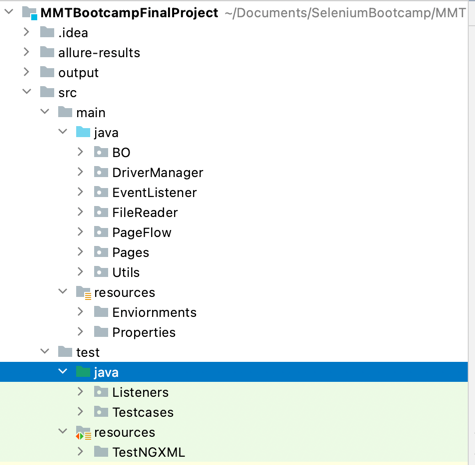

# MMTBootcampFinalProject

**OVERVIEW OF THE PROJECT**

Automating E2E Hotel booking scenario in makemytrip.com
_Scenario Steps_
- Click Hotel Tab
- Enter Location,checkIn and Checkout,No.of travellers.
- Apply filters like "4 star and above" and selecting a random price range.
- Selecting the 5th hotel from the list.(choosing last hotel, if no.of hotels in the list < 5)
- Asserting all the details inputed(like date,place,travellers etc) along with hotel name.
- Asserting the recommendation Box for the no of travellers
- Selcting a room and add travellers to the cart based on recommendation
- Asserting again the details in review page
- Inputing random traveller name and details in Traveller form 
- traversing to checkout page and assert traveller details.

_If a testcase fail, sreenshot will be taken automatically._

**PROJECT STRUCTURE**

_All Testcases are written in test/java/Testcases_
_Logs and failed screenshot can be found in /output_

**SYSTEM CONFIGURATION**

-   `Java > 1.8`
-   `Maven`
-   `TestNG`    
-   `Allure Reporting`

`Download and setup Allure from https://docs.qameta.io/allure/`

**HOW TO RUN TEST**

This project can be triggered in two ways  
- By Running MMTtestng.xml directly through TESTNG, _`test/resources/TestNGXML/MMTtestng.xml`_

- By Running `mvn clean test` through terminal.(Make sure you've `MAVEN` installed)

**CHALLENGES FACED WHILE AUTOMATING**

- Selection of CheckIn and CheckOut dates was bit tricky, came up with **DYNAMIC XPATH** creation logic to work with any dates.
- Applying range filer took me some time to automate properly as **STALE EXCEPTION** was happening.
- Counting travellers count in each Recommendation Box was bit challenging , but again **DYANMIC XPATH** helped a lot
- Adding travellers to cart is the most challenging moment, coudn't finish it properly ..will work on it and update in coming days.

**TO CHECK ALLURE REPORT**

_PreRequisite_ : Allure must be installed

To see report run `allure serve allure-results`

Logs and failed test screenshot of the run can be found in `/output`
